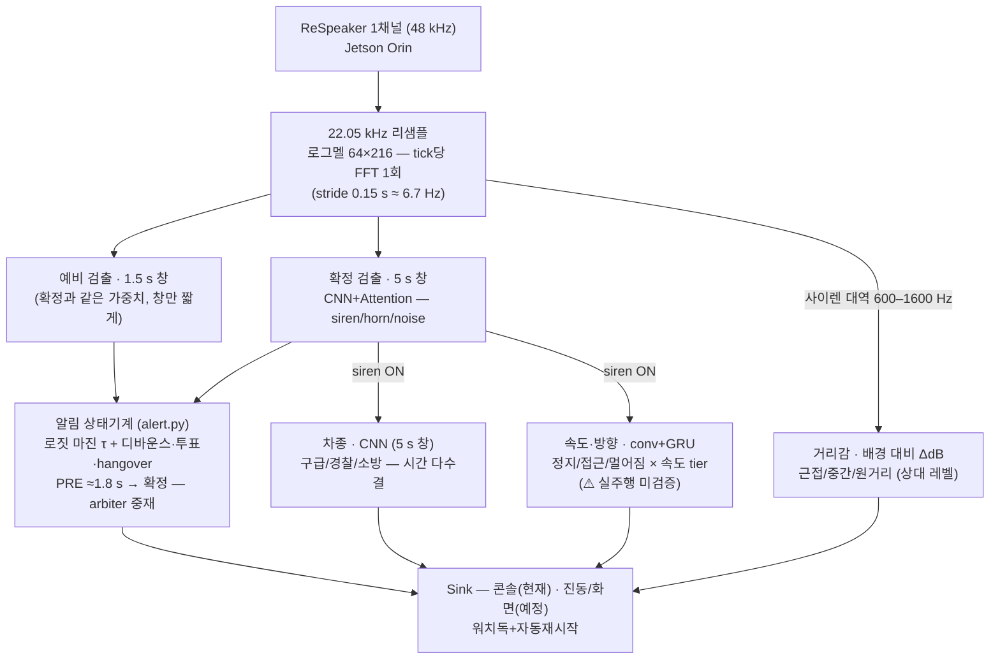

# Airacle — 청각장애 운전자용 긴급차량 사이렌 감지

> 마이크로 주변 소리를 실시간 분석해 **사이렌/경적을 감지**하고, **접근·이탈 방향과 속도 단계**를 산출해 시각·촉각으로 알리는 온디바이스 AI 시스템.

- **타겟 하드웨어**: NVIDIA **Jetson Orin Nano / NX** (GPU · TensorRT) + **4-mic 동기화 어레이** (48 kHz, TDOA 방향각용)
- **대상 사용자**: 청각장애 운전자

---

## 한 줄 요약

이 프로젝트는 두 가지를 **분리**해서 다룹니다.

| 기능 | 방법 | 이유 |
|------|------|------|
| **검출·차종** | 딥러닝 (멜+CNN) — CNN+Attention 채택, ViT 대조 | 진짜 라벨 28,643개 → 모델이 강함 |
| **속도·방향(접근/멀어짐)** | 순수 신경망 멜→속도 + 방향 3클래스 헤드 (물리는 학습용 '선생') | 속도 라벨이 **없음** → 물리(synth_passby)로 정답을 만들어 학습. 검증 결과 **순수 신경망이 물리를 전 구간 동급 이상** → 런타임 물리 0, 업데이트 가능. ⚠ 실주행 미검증(잠정) |
| **거리감** | 사이렌 대역(600–1600 Hz) 레벨 vs 배경 ΔdB (무학습) | 절대 거리는 불가(마이크 미캘리 + 원음압 편차) → 배경 대비 상대 tier(근접/중간/원거리)만 |
| **방향각(향후)** | TDOA 마스크 GCC-PHAT (4채널, 무학습) | 방향 라벨 없음 → 기하·위상으로 직접 계산. 시뮬 ±3° 검증 완료, **4-mic 어레이 확보 시 확장** |

핵심 통찰: **사이렌의 정지 기준 주파수·사이클을 데이터로 실측**하고 도플러를 **물리적으로 검증**(오차 1~2%)한 뒤, 그 물리를 **선생 삼아 순수 신경망 속도 모델을 학습**했습니다. 절대 속도는 단일 관측 한계(±56 km/h)가 있지만 통과 자기참조로 정밀해지고(물리 5–8 km/h), 학습 모델은 합성 평가에서 전 구간 물리 동급 이상이며, 출력은 **1~5단계(느림~빠름)**입니다.

---

## 시스템 구조 (현 배포 기준)

공통 **멜 front-end**(tick당 FFT 1회) 뒤에 **이중 창 검출이 게이트**하고, siren이면 **차종·속도방향·거리감이 병렬**로 붙어 알림 상태기계를 거쳐 출력됩니다. 최종 출력 — `사이렌/경적 + 위험도(정지/접근/멀어짐×속도) + 거리감 + 차종(잠정)`.



> **TDOA 방향각(전·후·좌·우)은 이 그림에 없다** — 4-mic 어레이 확보 후 확장 항목이며, 현재는 [`tdoa_sim.py`](tdoa_sim.py) 시뮬 검증(±3° @0 dB)까지만 완료. 현 배포의 "방향"은 속도망의 접근/멀어짐 3클래스 헤드다.

> **검출과 속도는 별도 네트워크**다 — 검출은 시간을 *뭉치는* 분류(국소 텍스처), 속도는 시간을 *보존하는* 시퀀스(글라이드 궤적)라 요구가 정반대. 한 백본 공유가 실패함을 실측으로 확인(동결 검출 백본 속도 head ~20 km/h) → 속도는 conv+GRU 별도 구조. 검출·차종은 둘 다 멜 분류라 백본 공유 가능.
> **물리(도플러)의 역할**: 런타임 추론 경로엔 없음. 속도 신경망의 **학습용 f0 '선생'**(합성에서 정답 생성) + 선택적 **검산**으로만 사용 → 출하 제품은 순수 학습 모델, 현장 데이터로 업데이트 가능.

### 구성요소 요약

| 구성요소 | 모델 / 방법 | 핵심 결과 |
|---|---|---|
| **검출** | CNN+Attention (멜), 이중 창(1.5 s 예비 + 5 s 확정) | 맑음 99% / 0 dB 91~92% (증강이 핵심) · **예비경보 실측 1.76 s** |
| **차종** | CNN (멜) — 유튜브 실채널 파인튜닝(`_yt`) | in-domain 86%(구세대 `_dom` 89%에서 트레이드) · **실채널 held-out 1/5→3/5** — 잠정(다수결+신뢰 미달 시 '긴급차량') |
| **속도·방향** | conv+GRU + 방향 3클래스 헤드(정지/접근/멀어짐) | 합성 평가 전 구간 물리 동급 이상 — **⚠ 실주행 미검증(잠정, tier 표시만)** |
| **거리감** | 사이렌 대역 레벨 vs 배경 ΔdB (무학습) | 근접(≥20 dB)/중간(≥10)/원거리 + 추세 ↗↘ — 경계는 실주행 캘리 전 placeholder |
| **방향각(향후)** | TDOA 마스크 GCC-PHAT (4채널) | 모의 ±3° @0 dB — 4-mic 어레이 확보 시 |

Orin(GPU·TensorRT)에서 전부 실시간 여유 → 비교의 초점은 지연이 아니라 **정확도·견고성**입니다. 실시간 운용(stride 0.15 s ≈ 6.7 Hz tick, 예비경보 실측 1.76 s)과 모델 비교·실패 모드·평가 프로토콜: [docs/04](docs/04-architecture-and-comparison.md)
**⚠ 검출 τ_on=1.2는 실주행 근거로 인하된 값 — 하드네거티브 FA 재캘리(`eval_hardneg --stride 0.15`)가 다음 관문입니다.**

---

## 배포 런타임 (Jetson) — 코드를 처음 보면 여기서 시작

```bash
./run.sh            # 검출 경보 + 속도방향 tier + 차종(잠정) — 크래시·마이크 사망 시 자동 재시작
./run.sh --debug    # tick마다 상세(pred·margin·v̂)
./run.sh --det-only # 검출만
```

**현역 모델** — run.sh가 파일 존재로 자동 선택. 전체 목록·아카이브 구분은 [models/README.md](models/README.md):

| 역할 | 현역 파일 | 선택 근거 (커밋) |
|---|---|---|
| 검출 확정(5 s 창) | `cnn_attn_full_s42` | P1 사다리: 0 dB에서 ViT 동급·7.6× 작음 (`d4e1519`~) |
| 검출 예비(1.5 s 창) | `cnn_attn_full_s42_65f` | 같은 가중치·짧은 창 — PRE 2.69→1.76 s (`0afcdcc`) |
| 속도+방향 | `speed_neural_dir` | 방향 3클래스 헤드 (`b51a629`) — ⚠ 실주행 미검증 |
| 차종 | `subtype_cnn_attn_yt_s42` | 실채널 held-out 1/5→3/5, in-domain 89→86 트레이드 (`c8e5968`) |

**빌드 파이프라인**: 학습(.pt) → [`export_onnx.py`](export_onnx.py)(레거시 익스포터 — GRU 충실) → scp → 젯슨 [`jetson_build.sh`](jetson_build.sh)(trtexec FP16) → run.sh 자동 감지.
**맥 개발**: 엔진 자리에 `.pt`를 주면 같은 런타임이 그대로 돈다 — `python3 infer_trt.py --live --engine models/cnn_attn_full_s42.pt`

---

## 측정으로 확정된 핵심 사실

> 전부 로컬 AI Hub 데이터에서 직접 측정. 스크립트: [`analyze_siren_freq.py`](analyze_siren_freq.py), [`analyze_siren_cycle.py`](analyze_siren_cycle.py), [`doppler_cycle_test.py`](doppler_cycle_test.py)

- **사이렌 주파수**: 기본주파수 ~334 Hz, 지배 톤 **~964 Hz**(≈3배음), 전체의 85%가 700–1200 Hz
- **사이클 주기**: 경찰 ~0.34 s(일정), 구급 ~0.34 s, 소방 **이봉**(빠른 0.2 s / 느린 4.7 s)
- **차종 분리**: 피치×사이클 2D로 ~53%(랜덤 33%) → 차종 ID는 **비핵심**
- **도플러 물리**: 피치 ×k, 사이클 ×1/k (실측 오차 ~1%)
- **속도 추정 정밀도**: [docs/03 참고](docs/03-doppler-speed.md)
  - 단일 관측(모집단 기준): **±56 km/h** (사이클) / ±202 km/h (피치) — 정보이론 한계
  - 통과(pass-by) 비율: **중앙값 5–8 km/h**, 10 dB 잡음까지 견고

자세한 내용 → [docs/02-acoustic-analysis.md](docs/02-acoustic-analysis.md), [docs/03-doppler-speed.md](docs/03-doppler-speed.md)

---

## 저장소 구조

```
.
├── README.md / requirements.txt
│
│  ── 배포 (Jetson 제품 경로) ──
├── run.sh                   # ★ 실행 진입점 — 엔진 자동 선택 + 자동 재시작
├── jetson_build.sh          # ONNX → TensorRT FP16 엔진 빌드 (젯슨에서)
├── infer_trt.py             # ★ 통합 런타임 — TRT/.pt 겸용, 이중 창, 워치독, 거리감
├── alert.py                 # ★ 알림 상태기계 + 거리감/속도/차종 트래커 + Sink
├── export_onnx.py           # .pt → ONNX + PyTorch 일치 검증
├── infer.py                 # 맥 개발·평가용 추론 (모델 로더는 다른 스크립트가 공용)
│
│  ── 데이터·학습 (재현 경로) ──
├── siren_data.py            # AI Hub 데이터 로더 (NFC 안전)
├── dataset.py               # P0 파이프라인 — 원본단위 split·청크·멜 캐시 (누수 0)
├── models.py / train.py     # 검출 사다리 (B1 CNN / B2 CNN+Attn / B3 ViT) 학습·운용점
├── augment.py               # 멜 증강 + 채널(도메인) 증강
├── subtype_clf.py           # 차종 분류 학습 (구급·경찰·소방)
├── finetune_subtype_yt.py   # 차종 유튜브 실채널 파인튜닝 (_yt — 현역 차종의 출처)
├── speed_neural.py          # ★ 현역 속도·방향 학습 (물리=선생, --dir-head)
│
│  ── 물리·평가 하네스 ──
├── doppler_speed.py         # 도플러 물리 (속도 학습의 f0 '선생' — 현역 의존성)
├── speed_baseline.py        # 물리 속도 벤치마크 (신경망이 넘어야 할 기준선)
├── eval_hardneg.py          # 닮은꼴 FA 평가 — τ_on 캘리 관문 (stride는 런타임과 동일하게)
├── eval_snr.py / eval_robust.py / run_ladder.py / calib_tier.py   # SNR·채널·사다리·tier 캘리
│
│  ── 아카이브·향후 (배포 경로 아님) ──
├── speed_head.py            # 실험 종결(동결 head 실패) — 단 synth_passby를 현역이 import(삭제 금지)
├── speed_seq.py             # 아카이브 — speed_neural로 대체됨
├── tdoa_sim.py              # TDOA 시뮬 (4-mic 어레이 확보 시 방향각 확장용)
├── analyze_*.py             # 일회성 음향 실측 (결과는 docs/02·03에 확정)
│
├── models/                  # 체크포인트·ONNX — 현역/아카이브 구분: models/README.md
├── hardware/                # 지붕 마이크 케이스 (OpenSCAD)
└── docs/
    ├── 01-dataset.md
    ├── 02-acoustic-analysis.md
    ├── 03-doppler-speed.md
    ├── 04-architecture-and-comparison.md
    ├── 05-roadmap.md
    ├── 06-model-design-and-training.md   # 모델 상세 설계 · 증강 논문 근거 · 베이스라인
    └── 07-cloud-training.md              # RunPod 클라우드 학습 런북
```

> **데이터셋은 저장소에 포함하지 않습니다** (AI Hub 라이선스 + 용량). [docs/01-dataset.md](docs/01-dataset.md)에서 받는 법과 배치 경로를 설명합니다.

---

## 빠른 시작

```bash
pip install -r requirements.txt

# ── 제품 실행 (Jetson — 엔진은 jetson_build.sh로 먼저 빌드) ──
./run.sh

# ── 맥에서 라이브 개발 (.pt 백엔드 — 내장 마이크, 같은 런타임) ──
python3 infer_trt.py --live --engine models/cnn_attn_full_s42.pt

# ── 학습 재현 (검출) ──
python dataset.py                        # 인덱스 빌드 + 누수 0 검증
python train.py --model cnn_attn --aug full

# ── 음향 분석 (일회성 실측 — 결과는 docs/02·03에 이미 확정) ──
python siren_data.py && python analyze_siren_freq.py
```

데이터 경로는 각 스크립트 상단 `DATASET_ROOT` / `ROOT` 상수에서 설정합니다.

---

## 현재 상태

- [x] 데이터 로더 (NFC 이슈 해결) + **P0 파이프라인** (`dataset.py` — 원본 단위 split, 누수 0 검증, 멜 캐시)
- [x] 사이렌 음향 특성 실측 (주파수 · 사이클)
- [x] 도플러 속도 모듈 + 합성 pass-by 검증 (중앙값 5–8 km/h)
- [x] Viterbi 문맥 추적 (배음 널뛰기 19.2% → 3.6%)
- [x] **검출 사다리 학습** (`models.py`·`train.py` — B1 CNN / B2 CNN+Attn / B3 ViT, 증강 ablation)
- [x] **저SNR 견고성 스윕** (`eval_snr.py` — 검출 판정은 clean이 아니라 0 dB 운용점에서)
- [x] **물리 속도 베이스라인** (`speed_baseline.py` — 정지 큐레이션 + synth_passby, 3–8 km/h)
- [x] **순수 신경망 멜→속도 + 방향 헤드** (`speed_neural.py` — 물리=학습 선생, 런타임 물리 0)
- [x] **TDOA 시뮬레이터** (`tdoa_sim.py` — bearing ±3°@0 dB; 하드웨어는 향후)
- [x] **Jetson TensorRT 통합 배포** (`run.sh`·`infer_trt.py`·`alert.py` — 이중 창 PRE 실측 1.76 s, 상태기계, 오디오 워치독+자동 재시작)
- [x] **실주행 1차 튜닝** (τ_on 2.0→1.5→1.2 — 저SNR 근접 구급차 첫 경보 34 s→6.2 s)
- [x] **차종 실채널 파인튜닝** (`finetune_subtype_yt.py` — `_yt` held-out 1/5→3/5; 채널 갭이 한계로 확정, 잠정 표시 유지)
- [x] **거리감 출력** (사이렌 대역 ΔdB — 근접/중간/원거리 상대 tier)
- [ ] **하드네거티브 FA 재캘리** (`eval_hardneg --stride 0.15` — τ_on 1.2 근거를 현 stride로 재확보) — **다음 관문**
- [ ] **속도·방향 실주행 검증 + tier·거리감 경계 캘리** (`calib_tier.py` — 그 전까지 잠정 표시)
- [ ] TDOA 방향각 (전후좌우) — 4-mic 어레이 확보 시

### P1 실측 결과 (중요 — clean 정확도는 함정)

- **증강이 견고성의 레버**: 무증강 모델은 0 dB에서 siren recall 0.57~0.70으로 붕괴, 증강하면 0.91~0.92 유지. clean 정확도(0.997)는 모두 천장에 붙어 **모델 변별 불가** → 판정은 **저SNR 운용점**에서.
- **검출은 CNN+Attn ≈ ViT** (증강 일치 시 0 dB에서 0.910 vs 0.918, 단일시드 노이즈 내). 동률이면 **효율로 CNN+Attn** (7.6× 작음). ViT는 증강 선택에 민감(`wave`는 OK, `full`의 Mixup/CutMix에서 캘리브레이션 저하).
- **물리 속도(학습 선생)는 노이즈에 거의 면역** (5 dB까지 3–8 km/h, 기권 1~2%). 약점은 저SNR이 아니라 **차선거리**(d_min 30 m → 8.3 km/h). 순수 신경망은 이 약점(원거리)까지 학습으로 보정해 전 구간 동급 이상.
- **TDOA 방향은 4채널 1개로 완성** (0 dB ±3°). 8채널 거리는 시차 한계로 ~30m 이내만 → **2번째 어레이는 조건부**.

전체 비교·판정 근거 → [docs/04](docs/04-architecture-and-comparison.md)

→ 전체 로드맵: [docs/05-roadmap.md](docs/05-roadmap.md)
