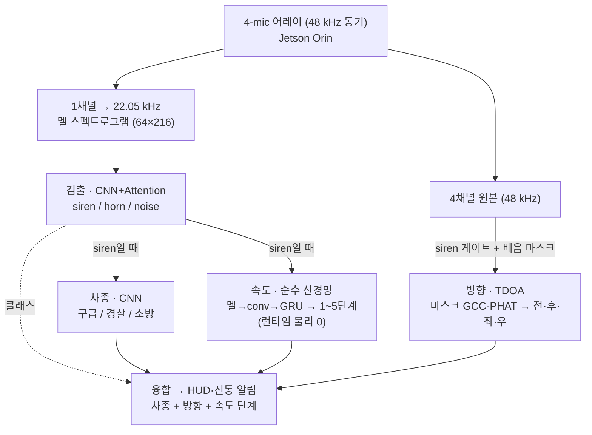

# Airacle — 청각장애 운전자용 긴급차량 사이렌 감지

> 마이크로 주변 소리를 실시간 분석해 **사이렌/경적을 감지**하고, **접근·이탈 방향과 속도 단계**를 산출해 시각·촉각으로 알리는 온디바이스 AI 시스템.

- **타겟 하드웨어**: NVIDIA **Jetson Orin Nano / NX** (GPU · TensorRT) + **4-mic 동기화 어레이** (48 kHz, TDOA 방향각용)
- **대상 사용자**: 청각장애 운전자

---

## 한 줄 요약

이 프로젝트는 두 가지를 **분리**해서 다룹니다.

| 기능 | 방법 | 이유 |
|------|------|------|
| **검출·차종** | 딥러닝 (멜+CNN) — CNN+Attention 채택, ViT 대조 | 진짜 라벨 28,643개 → 모델이 강함 |
| **속도** | 순수 신경망 멜→속도 (물리는 학습용 '선생') | 속도 라벨이 **없음** → 물리(synth_passby)로 정답을 만들어 학습. 검증 결과 **순수 신경망이 물리를 전 구간 동급 이상** → 런타임 물리 0, 업데이트 가능 |
| **방향** | TDOA 마스크 GCC-PHAT (4채널, 무학습) | 방향 라벨 없음 → 기하·위상으로 직접 계산 |

핵심 통찰: **사이렌의 정지 기준 주파수·사이클을 데이터로 실측**하고 도플러를 **물리적으로 검증**(오차 1~2%)한 뒤, 그 물리를 **선생 삼아 순수 신경망 속도 모델을 학습**했습니다. 절대 속도는 단일 관측 한계(±56 km/h)가 있지만 통과 자기참조로 정밀해지고(물리 5–8 km/h), 학습 모델은 합성 평가에서 전 구간 물리 동급 이상이며, 출력은 **1~5단계(느림~빠름)**입니다.

---

## 시스템 구조

공통 **멜 front-end**(한 번만 계산) 뒤에 **검출이 게이트**하고, siren이면 **차종·속도·방향이 병렬**로 붙어 알림으로 융합됩니다. 최종 출력 — `차종 + 방향 + 속도 단계`.



> **검출과 속도는 별도 네트워크**다 — 검출은 시간을 *뭉치는* 분류(국소 텍스처), 속도는 시간을 *보존하는* 시퀀스(글라이드 궤적)라 요구가 정반대. 한 백본 공유가 실패함을 실측으로 확인(동결 검출 백본 속도 head ~20 km/h) → 속도는 conv+GRU 별도 구조. 검출·차종은 둘 다 멜 분류라 백본 공유 가능.
> **물리(도플러)의 역할**: 런타임 추론 경로엔 없음. 속도 신경망의 **학습용 f0 '선생'**(합성에서 정답 생성) + 선택적 **검산**으로만 사용 → 출하 제품은 순수 학습 모델, 현장 데이터로 업데이트 가능.

### 구성요소 요약

| 구성요소 | 모델 / 방법 | 핵심 결과 |
|---|---|---|
| **검출** | CNN+Attention (멜) — ViT 대조 후 채택 | 맑음 99% / 0 dB 91~92% (증강이 잡음 견딤의 핵심) |
| **차종** | CNN (멜) | 87~90% (구급·경찰·소방; 소방 잘 분리, 경찰↔구급 일부 혼동) |
| **속도** | 순수 신경망 멜→속도 (conv+GRU) | 전 구간 물리 동급 이상(중·원거리 2배), 런타임 물리 0, 업데이트 가능 |
| **방향** | TDOA 마스크 GCC-PHAT (4채널) | 모의 ±3° @0 dB (실하드웨어 검증 예정) |

Orin(GPU·TensorRT)에서 전부 실시간 여유 → 비교의 초점은 지연이 아니라 **정확도·견고성**입니다. 실시간 운용 설계(검출 4 Hz tick, 가청 후 ~1.5 s 1차 경보)와 모델 비교·실패 모드·평가 프로토콜: [docs/04](docs/04-architecture-and-comparison.md)
**⚠ 현재 결과는 합성 데이터·단일시드 기준 — 실도로 녹음 검증이 다음 관문입니다.**

---

## 측정으로 확정된 핵심 사실

> 전부 로컬 AI Hub 데이터에서 직접 측정. 스크립트: [`analyze_siren_freq.py`](analyze_siren_freq.py), [`analyze_siren_cycle.py`](analyze_siren_cycle.py), [`doppler_cycle_test.py`](doppler_cycle_test.py)

- **사이렌 주파수**: 기본주파수 ~334 Hz, 지배 톤 **~964 Hz**(≈3배음), 전체의 85%가 700–1200 Hz
- **사이클 주기**: 경찰 ~0.34 s(일정), 구급 ~0.34 s, 소방 **이봉**(빠른 0.2 s / 느린 4.7 s)
- **차종 분리**: 피치×사이클 2D로 ~53%(랜덤 33%) → 차종 ID는 **비핵심**
- **도플러 물리**: 피치 ×k, 사이클 ×1/k (실측 오차 ~1%)
- **속도 추정 정밀도**: [docs/03 참고](docs/03-doppler-speed.md)
  - 단일 관측(모집단 기준): **±56 km/h** (사이클) / ±202 km/h (피치) — 정보이론 한계
  - 통과(pass-by) 비율: **중앙값 5–8 km/h**, 10 dB 잡음까지 견고

자세한 내용 → [docs/02-acoustic-analysis.md](docs/02-acoustic-analysis.md), [docs/03-doppler-speed.md](docs/03-doppler-speed.md)

---

## 저장소 구조

```
.
├── README.md
├── requirements.txt
├── siren_data.py            # AI Hub 데이터 로더 (NFC 안전, 3-클래스 확장)
├── dataset.py               # P0 파이프라인 — 원본단위 split·청크·멜 캐시 (누수 0)
├── models.py                # 검출 사다리 — PlainCNN / CNNAttn / ViT
├── train.py                 # 학습·운용점 평가 (macro-F1 · siren recall · FA/h)
├── augment.py               # 멜 도메인 증강 (배속·잡음·SpecAugment·Mixup)
├── run_ladder.py            # 사다리 일괄 실행기 (results 기반 멱등 재개)
├── eval_snr.py              # 저SNR 견고성 스윕 (검출 진짜 판정)
├── subtype_clf.py           # 차종 분류 (구급·경찰·소방, CNN)
├── doppler_speed.py         # 도플러 속도·방향 모듈 (물리 = 속도 학습용 '선생')
├── speed_baseline.py        # 물리 속도 베이스라인 (정지 큐레이션 + synth_passby)
├── speed_seq.py             # f0 궤적 시퀀스 속도 모델 (bi-GRU)
├── speed_neural.py          # ★순수 신경망 멜→속도 (런타임 물리 0, 업데이트 가능)
├── tdoa_sim.py              # 마이크 어레이 TDOA 정확도 시뮬레이터
├── analyze_siren_freq.py    # 사이렌 정지 주파수 실측
├── analyze_siren_cycle.py   # 사이클 주기 · 피치×사이클 분리도
├── doppler_cycle_test.py    # 사이클 기반 속도 추정 검증
└── docs/
    ├── 01-dataset.md
    ├── 02-acoustic-analysis.md
    ├── 03-doppler-speed.md
    ├── 04-architecture-and-comparison.md
    ├── 05-roadmap.md
    ├── 06-model-design-and-training.md   # 모델 상세 설계 · 증강 논문 근거 · 베이스라인
    └── 07-cloud-training.md              # RunPod 클라우드 학습 런북
```

> **데이터셋은 저장소에 포함하지 않습니다** (AI Hub 라이선스 + 용량). [docs/01-dataset.md](docs/01-dataset.md)에서 받는 법과 배치 경로를 설명합니다.

---

## 빠른 시작

```bash
pip install -r requirements.txt

# 1) 데이터 로더 확인 (사이렌 2,239개)
python siren_data.py

# 2) 사이렌 정지 주파수 실측
python analyze_siren_freq.py

# 3) 사이클 주기 · 피치×사이클 분리도
python analyze_siren_cycle.py

# 4) 도플러 속도 모듈 검증 (합성 pass-by + 잡음 스트레스)
python doppler_speed.py
```

데이터 경로는 각 스크립트 상단 `DATASET_ROOT` / `ROOT` 상수에서 설정합니다.

---

## 현재 상태

- [x] 데이터 로더 (NFC 이슈 해결) + **P0 파이프라인** (`dataset.py` — 원본 단위 split, 누수 0 검증, 멜 캐시)
- [x] 사이렌 음향 특성 실측 (주파수 · 사이클)
- [x] 도플러 속도 모듈 + 합성 pass-by 검증 (중앙값 5–8 km/h)
- [x] Viterbi 문맥 추적 (배음 널뛰기 19.2% → 3.6%)
- [x] **검출 사다리 학습** (`models.py`·`train.py` — B1 CNN / B2 CNN+Attn / B3 ViT, 증강 ablation)
- [x] **저SNR 견고성 스윕** (`eval_snr.py` — 검출 판정은 clean이 아니라 0 dB 운용점에서)
- [x] **물리 속도 베이스라인** (`speed_baseline.py` — 정지 큐레이션 + synth_passby, 3–8 km/h)
- [x] **차종 분류** (`subtype_clf.py` — 구급·경찰·소방 87~90%)
- [x] **순수 신경망 멜→속도** (`speed_neural.py` — 물리=학습 선생, 런타임 물리 0; 전 구간 물리 동급 이상)
- [x] **TDOA 시뮬레이터** (`tdoa_sim.py` — bearing ±3°@0 dB, 거리 시차 한계 ~30m)
- [ ] **실도로 녹음 검증** (합성→실데이터 sim-to-real) + 젯슨 TensorRT 통합 — **다음 관문**

### P1 실측 결과 (중요 — clean 정확도는 함정)

- **증강이 견고성의 레버**: 무증강 모델은 0 dB에서 siren recall 0.57~0.70으로 붕괴, 증강하면 0.91~0.92 유지. clean 정확도(0.997)는 모두 천장에 붙어 **모델 변별 불가** → 판정은 **저SNR 운용점**에서.
- **검출은 CNN+Attn ≈ ViT** (증강 일치 시 0 dB에서 0.910 vs 0.918, 단일시드 노이즈 내). 동률이면 **효율로 CNN+Attn** (7.6× 작음). ViT는 증강 선택에 민감(`wave`는 OK, `full`의 Mixup/CutMix에서 캘리브레이션 저하).
- **물리 속도(학습 선생)는 노이즈에 거의 면역** (5 dB까지 3–8 km/h, 기권 1~2%). 약점은 저SNR이 아니라 **차선거리**(d_min 30 m → 8.3 km/h). 순수 신경망은 이 약점(원거리)까지 학습으로 보정해 전 구간 동급 이상.
- **TDOA 방향은 4채널 1개로 완성** (0 dB ±3°). 8채널 거리는 시차 한계로 ~30m 이내만 → **2번째 어레이는 조건부**.

전체 비교·판정 근거 → [docs/04](docs/04-architecture-and-comparison.md)
- [ ] (이후) TDOA 방향각 — 4-mic 어레이, 방향→속도 직렬 연결

→ 전체 로드맵: [docs/05-roadmap.md](docs/05-roadmap.md)
