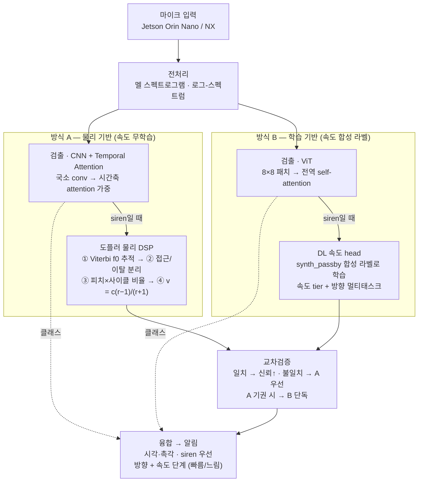

# Airacle — 청각장애 운전자용 긴급차량 사이렌 감지

> 마이크로 주변 소리를 실시간 분석해 **사이렌/경적을 감지**하고, **접근·이탈 방향과 속도 단계**를 산출해 시각·촉각으로 알리는 온디바이스 AI 시스템.

- **타겟 하드웨어**: NVIDIA **Jetson Orin Nano / NX** (GPU · TensorRT)
- **대상 사용자**: 청각장애 운전자

---

## 한 줄 요약

이 프로젝트는 두 가지를 **분리**해서 다룹니다.

| 기능 | 방법 | 이유 |
|------|------|------|
| **검출** (siren/horn/noise) | 딥러닝 — CNN+Attention(A) vs ViT(B) 비교 | 진짜 라벨 28,643개가 있음 → 모델이 강함 |
| **방향·속도** | 물리 DSP(A) **vs** synth_passby 증강 학습 DL(B) — **교차검증** | 데이터에 속도/방향 라벨이 **없음** → A는 라벨 없이 물리식으로 동작(안전 기본값), B는 통과 합성으로 라벨을 **만들어** 학습. **증강 학습이 물리식을 재현·능가하는지가 방식 B의 핵심 검증 질문** |

핵심 통찰: **사이렌의 정지 기준 주파수·사이클을 데이터로 실측**했고, 도플러로 속도가 어떻게 변하는지를 **물리적으로 검증**했습니다. 절대 속도는 단일 관측에서 식별 한계(±50 km/h)가 있지만, **통과(pass-by) 자기참조**로 정밀해지고(7–9 km/h), 무엇보다 **"빠름/느림 단계"** 판별엔 충분합니다.

---

## 시스템 구조

공통 프런트엔드(마이크 → 전처리) 뒤에 **두 방식이 병렬**로 붙고, 교차검증을 거쳐 알림으로 융합됩니다. 두 방식 모두 출력은 같습니다 — `클래스 + 방향 + 속도 단계`.



### 두 방식의 차이 (요약)

| | 방식 A — CNN + Temporal Attention | 방식 B — ViT |
|---|---|---|
| 시간 구조 포착 | conv가 국소 패턴, attention이 시간축 가중 | self-attention이 **전역 반복(사이클)을 1층부터 직접** |
| 데이터 요구량 | 적음 (귀납적 편향) — siren 2,239에 안정 | 큼 — SpecAugment/Mixup/CutMix 필수 |
| 속도 추정 짝 | **물리 DSP** — 무학습 · 해석가능 · sim-real 갭 0 | **DL head** — synth_passby 라벨 · 잡음강인 기대 |
| 속도 실패 양상 | 모르면 **기권** (게이트) — 안전 | 항상 답하지만 분포 밖 보증 없음 |
| 파라미터 | ~0.6M | ~0.8M |

Orin(GPU·TensorRT)에서는 둘 다 실시간 여유 → 비교의 초점은 지연이 아니라 **정확도·견고성**입니다. 축별 상세 비교·실패 모드·평가 프로토콜: [docs/04](docs/04-architecture-and-comparison.md)

---

## 측정으로 확정된 핵심 사실

> 전부 로컬 AI Hub 데이터에서 직접 측정. 스크립트: [`analyze_siren_freq.py`](analyze_siren_freq.py), [`analyze_siren_cycle.py`](analyze_siren_cycle.py), [`doppler_cycle_test.py`](doppler_cycle_test.py)

- **사이렌 주파수**: 기본주파수 ~320 Hz, 지배 톤 **~960 Hz**(3배음), 전체의 87%가 700–1200 Hz
- **사이클 주기**: 경찰 ~0.34 s(일정), 구급 ~0.34 s, 소방 **이봉**(빠른 0.2 s / 느린 4.7 s)
- **차종 분리**: 피치×사이클 2D로 ~51%(랜덤 33%) → 차종 ID는 **비핵심**
- **도플러 물리**: 피치 ×k, 사이클 ×1/k (실측 오차 ~1%)
- **속도 추정 정밀도**: [docs/03 참고](docs/03-doppler-speed.md)
  - 단일 관측(모집단 기준): **±50 km/h** (사이클) / ±197 km/h (피치) — 정보이론 한계
  - 통과(pass-by) 비율: **중앙값 7–9 km/h**, 10 dB 잡음까지 견고

자세한 내용 → [docs/02-acoustic-analysis.md](docs/02-acoustic-analysis.md), [docs/03-doppler-speed.md](docs/03-doppler-speed.md)

---

## 저장소 구조

```
.
├── README.md
├── requirements.txt
├── siren_data.py            # AI Hub 데이터 로더 (NFC 안전, 3-클래스 확장)
├── doppler_speed.py         # 도플러 속도·방향 모듈 (핵심)
├── analyze_siren_freq.py    # 사이렌 정지 주파수 실측
├── analyze_siren_cycle.py   # 사이클 주기 · 피치×사이클 분리도
├── doppler_cycle_test.py    # 사이클 기반 속도 추정 검증
└── docs/
    ├── 01-dataset.md
    ├── 02-acoustic-analysis.md
    ├── 03-doppler-speed.md
    ├── 04-architecture-and-comparison.md
    ├── 05-roadmap.md
    └── 06-model-design-and-training.md   # 모델 상세 설계 · 증강 논문 근거 · 베이스라인
```

> **데이터셋은 저장소에 포함하지 않습니다** (AI Hub 라이선스 + 용량). [docs/01-dataset.md](docs/01-dataset.md)에서 받는 법과 배치 경로를 설명합니다.

---

## 빠른 시작

```bash
pip install -r requirements.txt

# 1) 데이터 로더 확인 (사이렌 2,239개)
python siren_data.py

# 2) 사이렌 정지 주파수 실측
python analyze_siren_freq.py

# 3) 사이클 주기 · 피치×사이클 분리도
python analyze_siren_cycle.py

# 4) 도플러 속도 모듈 검증 (합성 pass-by + 잡음 스트레스)
python doppler_speed.py
```

데이터 경로는 각 스크립트 상단 `DATASET_ROOT` / `ROOT` 상수에서 설정합니다.

---

## 현재 상태

- [x] 데이터 로더 (NFC 이슈 해결)
- [x] 사이렌 음향 특성 실측 (주파수 · 사이클)
- [x] 도플러 속도 모듈 + 합성 pass-by 검증 (중앙값 7–9 km/h)
- [x] Viterbi 문맥 추적 (배음 널뛰기 19.2% → 3.6%)
- [ ] 속도 단계(tier) 래퍼 + 실시간 스트리밍
- [ ] 검출 모델 (CNN+Attn vs ViT) 학습 + TensorRT
- [ ] 방식 B (synth_passby 학습 DL 속도) + 교차검증

→ 전체 로드맵: [docs/05-roadmap.md](docs/05-roadmap.md)
