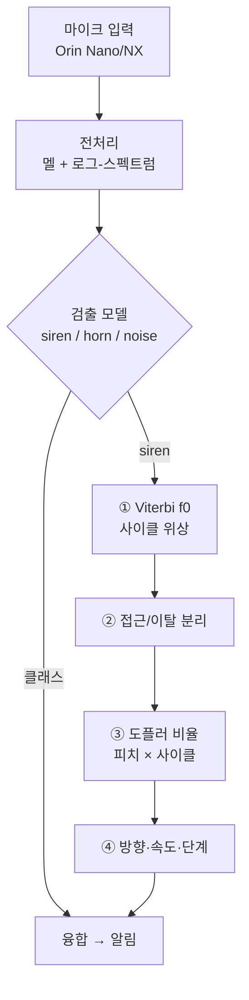
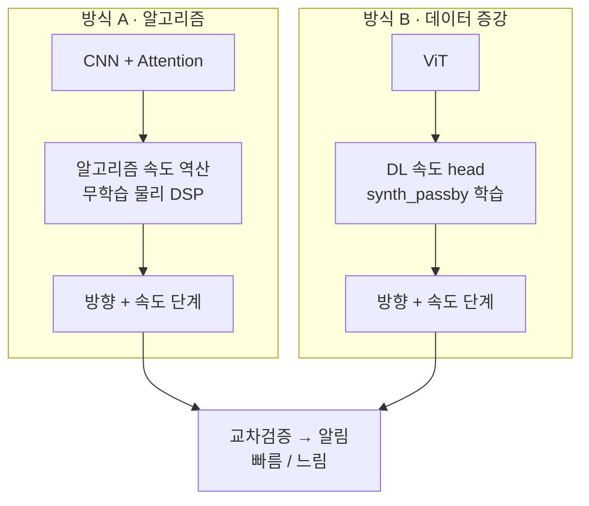

# 04 · 아키텍처 & 설계 방식 비교

## 설계 원칙: 세 축을 분리한다

초기 두 "패키지" 안은 사실 **독립적인 3개 축**을 섞고 있었다. 공정한 비교는 한 축씩 바꾸는 것.

| 축 | 선택지 | 핵심 |
|----|--------|------|
| 검출 모델 | CNN+Attention ↔ ViT | 둘 다 Orin OK. 진짜 비교 가치 |
| 증강 | 슬라이딩윈도우 ↔ 배속/통과합성 | **양자택일 아님 — 같이 씀** |
| 속도 추정 | 알고리즘 DSP ↔ 딥러닝 | 진짜 갈림길 |

## 역할 분담의 근거: 라벨이 진짜냐 합성이냐

| 출력 | 라벨 출처 | 기준선 (안전 기본값) | 검증 대상 |
|------|----------|--------------------|----------|
| siren/horn/noise **검출** | 진짜 데이터 28,643개 | — | CNN+Attn(A) vs ViT(B) |
| 접근/이탈 **방향**, **속도** | 진짜 라벨 없음 → **합성으로만 생성 가능** | **물리 DSP(A)** — 라벨 불필요, sim-to-real 갭 0 | **ViT + synth_passby 증강 학습(B)** — 합성 라벨 학습이 물리식을 재현하는가 |

데이터에 방향·속도 정답이 없으므로, 학습으로 풀려면 **합성 라벨**이 유일한 길이고 그만큼 **합성→실제 전이 리스크**를 진다. 물리 DSP는 학습이 없어 그 리스크가 없고 해석가능하다(“주파수가 960→890으로 떨어짐 → 이탈”). 그래서 **A를 안전 기본값·채점 기준으로 두고, B(증강 학습)가 그걸 재현·능가하는지를 교차검증**하는 것이 이 비교의 핵심 질문이다 — DL은 "선택 사항"이 아니라 **검증 대상 가설**이다.

## 전체 구조



## 방식 A vs 방식 B (교차검증 대상)



| 항목 | 방식 A | 방식 B |
|------|--------|--------|
| 검출 모델 | CNN + Attention | ViT |
| 증강 | 슬라이딩 + 파형 | **synth_passby (통과 합성)** |
| 속도 추정 | 알고리즘 물리 DSP (무학습) | DL head (학습) |
| 속도 라벨 | 불필요 | synth_passby가 자동 생성 |
| 장점 | 해석가능 · 즉시 동작 · sim-real 갭 0 | end-to-end · 잡음강인 기대 |
| 단점 | 배음 edge case 수동 튜닝 | 합성→실제 전이 리스크 |
| 출력 | 방향 + 속도 단계 | 방향 + 속도 단계 |

위 표는 요약이고, 아래에 축별로 풀어서 설명한다.

### 축 1 · 검출 모델: CNN+Attention vs ViT

**CNN + Temporal Attention (0.110M params 실측)**
- 구조: Conv2d 블록 ×3 (32→64→128, 각 MaxPool) → 주파수축 풀링 → Temporal Attention(Linear 128→64 → Tanh → Linear 64→1 → Softmax) → 가중합 context vector → 분류기.
- 강점: convolution의 귀납적 편향(국소성·이동불변성) 덕에 **소량 데이터(siren 2,239)에서 안정적**. attention 가중치를 시각화하면 "윈도우의 어느 구간을 보고 판단했는지" 보여줄 수 있어 부분적 해석가능성도 있음.
- 약점: 수용영역이 국소적이라 4.7 s 장주기 wail 같은 **전역 반복 구조**는 층을 쌓아야 간접적으로 포착.

**ViT (0.838M params 실측)**
- 구조: 멜 스펙트로그램 → 8×8 패치 임베딩 → CLS 토큰 + positional embedding → Pre-LN Transformer encoder 4층(4헤드) → CLS로 분류.
- 강점: self-attention이 **전역 시간 구조(사이클 반복)를 1층부터 직접** 봄 → 윈도우 전체에 걸친 소방차 wail 패턴 등에 유리할 가능성.
- 약점: 귀납적 편향이 없어 데이터 요구량이 큼. 2~3만 샘플 규모에선 SpecAugment/Mixup/CutMix가 사실상 필수.

**하드웨어 변경이 이 비교에 주는 효과**: RPi5(CPU) 시절의 "CNN 20 ms vs ViT 40 ms" 지연 명분이 Orin(GPU·TensorRT)에서 소멸 → 이 비교는 **속도가 아니라 정확도·견고성** 싸움이 됨.

**공정 비교 조건**: 동일 split · 동일 증강 · 동일 학습 스케줄에서 **모델 축만** 교체. (증강을 모델과 묶어 바꾸면 성능 차이의 원인 식별 불가)

### 축 2 · 증강: 슬라이딩+파형 vs synth_passby

**공통 증강 (검출 학습용 — 두 방식 모두 사용)**
- 슬라이딩 윈도우: 5 s 윈도우 · 1 s stride (소방 wail 1주기 ~4.7 s 포함)
- 파형 레벨: 피치시프트 ±2반음, 타임스트레치 0.85~1.15×, 게인 ±6 dB, noise 클래스와 SNR 5~20 dB 합성
- 균일 배속 0.8~1.3×: 올바른 용도는 **검출기의 도플러 불변성 학습**(접근/이탈로 피치가 떠도 siren으로 인식). 속도 *라벨*로는 부적합 ([docs/03](03-doppler-speed.md)의 라벨 모순).

**B 전용: synth_passby (통과 합성)**
- 물리 모델: source 시간 τ → 관측 시간 `t = τ + r(τ)/c` 워핑, `r(τ) = √(d_min² + v²(τ−t₀)²)`, `1/r` 진폭 감쇠. 등속 직선 통과의 정확한 지연시간(retarded-time) 모델.
- **라벨 자동 생성**: 합성 파라미터 (v, d_min, SNR, t₀)를 우리가 정하므로 (스펙트로그램 → 연속 속도 v · 방향 · 통과시각) 학습쌍이 무한 생성됨.
- 랜덤화 권장 범위: v ~ U(0, 80 km/h) **연속 샘플링** (v=0 포함 — "정지"), d_min 5~30 m, SNR 5~20 dB, 시작 위상 랜덤.
- 본질: A/B의 차이는 "증강 종류"가 아니라 **속도 라벨을 만들어 학습하느냐**다.

### 축 3 · 속도 추정: 추정기 3종 비교

비교 대상은 **속도 추정기 3개**다 (증강은 토글이 아님 — 아래):

| | 추정기 | 학습 | "증강"의 위치 |
|---|---|---|---|
| **A** | 물리 DSP (`estimate_passby`) | ❌ | 해당 없음 — 학습 안 함. 견고성 레버는 테스트타임 집계(슬라이딩 중앙값) |
| **B** | DL 속도 head @ **CNN+Attn** 백본 | ✅ | synth_passby = **유일 훈련셋** (내재, 토글 아님 — 실속도 라벨이 없음) |
| **C** | DL 속도 head @ **ViT** 백본 | ✅ | synth_passby = 유일 훈련셋 |

- **B vs C가 핵심 질문**: attention의 전역 시야가 **속도(글라이드)** 에선 값어치를 하나? 검출에선 CNN+Attn≈ViT 동률(국소 텍스처)이었지만, 속도는 윈도우 시작↔끝 주파수 관계라 attention이 유리할 **이유가 있는** 자리 — ViT를 프로젝트에 넣은 원래 명분.
- 평가: 3 추정기 × 동일 synth 테스트셋 {clean·20·10·5 dB}×{d_min 5·15·30 m} + **자연 녹음 A–B/C 일치율**.
- (선택) **하이브리드**: 물리 추정값을 feature로 받는 학습 보정기 — "물리 안전성 + 학습 저SNR 커버" best-of-both.

**A: 무학습 물리 DSP (구현 완료 · 검증됨)**
1. **Viterbi f0 추적** — 하모닉 salience + 시간연속성 DP. 프레임 독립 추적의 배음 널뛰기 19.2% → 3.6%.
2. **접근/이탈 분리** — 글라이드(최대 하강) 검출로 pass-by 시각 추정.
3. **도플러 비율** — 접근·이탈 구간 평균 스펙트럼의 로그-주파수 상호상관 (전 배음이 함께 기여 → 잡음·널뛰기 강건). 물리 상한 캡 ratio < 1.2 (≈100 km/h) + prominence 게이트로 배음 오정합 차단. 진폭 envelope 사이클 비율로 교차확인.
4. **v = c(r−1)/(r+1)** → tier 비닝 → 슬라이딩 윈도우 시간축 중앙값.
- 실측 베이스라인(`speed_baseline.py`, 정지 120 클립): **중앙값 오차 3–8 km/h, 5 dB까지 거의 불변, 기권율 1–2%, 방향 93.8%**. 느린 속도가 더 어렵고(10 km/h 6.8 > 80 km/h 3.3), 약점은 차선거리(d_min 30 m → 8.3). 상세 표 [docs/03](03-doppler-speed.md) §방식 B 비교용 베이스라인.
- 연산 비용: FFT 수 회 + DP — Orin에서 ms 단위, GPU 불필요.
- ⚠ **이 강함의 절반은 home-advantage**: synth_passby 생성 물리를 그대로 역산 → 합성에서만 보장. 실데이터 일반화는 미검증.

**B/C: DL 속도 head (구축 예정 — P2b)**
- 입력: 검출 backbone의 feature 공유(추가 비용 ~0) 또는 별도 멜. 출력: **연속 속도 회귀 v̂**(km/h) + 접근/이탈 방향 logit (멀티태스크: Huber + BCE). 도플러 변화량이 `Δf/f ≈ v/c`로 **연속·준선형**이라 라벨도 연속 샘플링이 자연스럽고, 이산 tier 분류보다 보간 일반화에 유리 — tier는 v̂의 비닝으로 파생 ([docs/06](06-model-design-and-training.md) §3.1).
- 기대 이점: ① 추론 forward 1패스(가변 latency 없음) ② backbone 공유 시 사실상 공짜 ③ 백본 선택지(CNN+Attn=B vs ViT=C). ⚠ **"저SNR 커버"는 베이스라인이 약화시킴** — A가 5 dB에서도 1–2%만 기권하므로, B/C가 이길 자리는 **먼 차선·부분 윈도우·실데이터 일반화**로 좁혀짐.
- **핵심 리스크 — sim-to-real**: 합성이 못 담는 것들 = 잔향/다중경로(터널·빌딩 협곡), 자차 이동(상대속도 합성), 마이크·차체 음향 특성, 비표준/신형 사이렌. **합성셋 정확도가 실도로 정확도를 보장하지 않음.**
- 완화책: ① A와 상시 교차검증 ② 합성 다양화(잔향 IR, 자차속도 항 추가) ③ 신뢰도 보정(temperature scaling).

### 실패 모드 비교

| 상황 | 방식 A (DSP) | 방식 B (DL) |
|------|-------------|-------------|
| 소방차 빠른 yelp (0.17 s) | 배음 콤 오정합 → 캡/게이트로 기권 | 학습 분포에 포함 가능 → 우위 기대 |
| 소방차 느린 wail (4.7 s) | 윈도우 < 1주기면 비율 불안정 | 동일 한계 (정보 자체가 부족) |
| 저SNR (< 5 dB) | 게이트 기권 (무출력) | 출력은 내지만 신뢰도 불명 → 보정 필요 |
| 잔향·다중경로 | 비율 왜곡 가능 | 학습 안 했으면 예측 불가 |
| 다중 사이렌 동시 | 상호상관 피크 분리 가능 | 혼합 라벨 합성 추가하면 학습 가능 |
| 비표준 사이렌 (신형) | 물리식이라 그대로 적용 | 분포 밖 → 성능 저하 |

요약: **A는 "모르면 기권"(안전), B는 "항상 답하지만 보증 없음"** — 그래서 교차검증이 필요하다.

### 평가 프로토콜 (공정 비교)

1. **검증셋 고정**: 학습에 안 쓴 held-out 정지 클립에 synth_passby 적용 — 시드 고정, A·B 동일 셋.
2. **지표**: km/h MAE(A·B 모두 연속 출력), 파생 tier 정확도·혼동행렬, 방향(접근/이탈) 정확도.
3. **스트레스 sweep**: SNR {clean, 20, 10, 5 dB} × d_min {5, 15, 30 m} × 차종(경찰/구급/소방).
4. **실데이터 일치율**: 라벨 없는 자연 녹음(acqMethod=자연적)에서 A–B agreement 측정 — 합성셋에선 둘 다 좋은데 실데이터에서 불일치가 급증하면 **B의 도메인 갭 신호** (sim-to-real의 간접 지표).
5. **Orin 지연**: B는 TensorRT end-to-end, A는 FFT+DP 시간 별도 측정.

### 교차검증 · 운용 규칙

- 두 추정 **일치 → 신뢰도 상향** (알림 확신도 올림).
- **불일치 → A(물리)를 우선** — 안전 기본값. B는 보조 신호로 강등.
- A가 게이트로 **기권한 구간 → B 단독** 사용 + 신뢰도 하향 표기.
- **A가 B의 채점관**: 합성 검증셋에서 A가 정답에 근접(5–8 km/h)함이 확인됐으므로, 라벨 없는 실데이터에서 B의 품질을 "A와의 일치도"로 근사 평가할 수 있다.

### (이후 개발) TDOA 방향각 → 속도, 직렬 구조

방향을 도플러 부호가 아니라 **마이크 어레이 TDOA(도착시간차)** 로 직접 재는 확장:

- 출력이 접근/이탈 2값이 아니라 **방향각 θ(t)** — 알림 UX("어느 쪽에서 오나")에 더 유용.
- 속도와는 **병렬이 아니라 직렬이 맞다**: 도플러는 시선속도(v·cosθ)를 재므로 ([docs/03](03-doppler-speed.md) §기하 한계),
  bearing 추적이 통과 기하(접근상/전이/이탈상, 차선 거리)를 먼저 주면 속도 추정의 구간 선택·기하 보정의 사전정보가 된다.
- 단 ① 하드웨어는 **4-mic 동기화 어레이로 확정** (모델·마운트 위치 선정 남음) ② bearing도 잡음·잔향에 취약하므로
  도플러 접근/이탈 부호는 **독립 교차검증**으로 유지 ③ 방식 B(DL)의 입력은 단일채널 유지.

**"어떤 소리"의 방향인가 — 마스크된 GCC-PHAT.** 전대역 GCC-PHAT는 **"가장 큰 소리"의 방향**이지
사이렌의 방향이 아니다 (도로에선 옆 트럭·바람이 지배할 수 있음). 그래서 순서가 본질이다 —
**분류가 먼저, 방향은 "분류된 그 소리"에 대해**:

1. 검출 모델이 "사이렌 존재" 확정 (1차 경보는 이 시점에 이미 나감)
2. Viterbi f0 추적이 사이렌의 배음 위치(f0, 2f0, 3f0…)를 줌 — 이 트랙은 **공유 특징**이다
   (속도 추정도 같은 트랙을 쓰지만, 트랙 자체는 속도가 아님 — 아래 의존성 정리)
3. GCC-PHAT의 크로스 스펙트럼에서 **그 배음 빈들만 남기는 마스크** 적용 → 위상차가 사이렌
   에너지에서만 옴 = 사이렌의 방향각. 사이렌 톤은 협대역 집중이라 해당 빈의 **국소 SNR은
   전대역 SNR보다 훨씬 높다** (저SNR에서도 성립).

- 협대역 위상 모호(spatial aliasing): 0.1 m 간격은 ~1.7 kHz(λ/2) 이상 배음에서 지연 모호 —
  **여러 배음을 함께** 쓰면 전 빈에서 일관된 지연만 살아남아 해소.
- 다중 사이렌: 소스별 마스크가 다르면 방향도 분리 가능 (association 로직은 추후 과제).
- 같은 구조의 선행: Marchegiani & Newman 2022 *Listening for Sirens* — 분리(마스킹) 후 방향 추정의
  2단 구성 ([docs/06](06-model-design-and-training.md) §3.3 선행 표).

**의존성 정리 (순환 없음).** "방향이 f0를 쓰고, 속도가 방향을 쓰면, 속도 모듈의 f0를 방향이
먼저 쓰는 순환 아닌가?"라는 의문이 들 수 있다 — 아니다. **f0 추적은 속도 측정이 아니라 공유
특징 추출**이다 (트랙은 "배음이 어디 있나"는 지문일 뿐, 속도는 그 위에서 접근/이탈 구간을 골라
비율을 계산해야 나온다). 레이어로 쓰면 사이클 없는 DAG:

```
L0  검출 (siren 확정)
L1  Viterbi f0·배음 추적          ← 공유 특징 — L2·L3 둘 다의 입력 (그 자체론 둘 다 아님)
L2  방향각 θ(t) = 마스크된 GCC-PHAT(L1 마스크)
L3  속도 v      = 도플러 비율(L1 스펙트럼 + L2의 구간 선택·기하 보정)
L4  교차검증 · 융합 · 알림
```

"직렬(방향→속도)"은 **L2→L3 추정기 레벨**의 순서이고, L1은 그 아래층 전처리다.

**주의 — L1은 검출을 대체하지 못한다**: 트래커는 기권 없이 **아무 음원에나** 최선의 배음 경로를
내놓는다 (사이렌이 없어도 오토바이·경적·헬기 트랙을 반환). "무엇인가"는 L0(학습 검출)만 답할 수
있고, L1 마스크는 L0가 확정한 다음에야 "그 사이렌의 지문"이라는 의미를 갖는다. 룰 기반(트랙
안정성+사이클 게이트) 검출의 한계는 실측 근거가 있다 — 쉬운 과제(차종 구분)에서도 53%
([docs/02](02-acoustic-analysis.md) §3) vs 학습 검출 0.997. 격차 정량화는 docs/06 ablation 7.

**채널 단위 데이터 흐름 — TDOA에는 검출이 없다.** 시스템 유일의 검출은 L0(DL) 하나이고,
TDOA(L2)는 그 결론과 L1 마스크를 받아 위상차만 계산하는 무학습 기하 계산기다:

```
4-mic 어레이 (48 kHz ×4, 동기)
 ├─ 채널 1개 → 22.05 kHz → 멜 ─→ L0 DL 검출 (siren?)     ← 유일한 검출 (1채널로 충분)
 │                            └→ L1 f0·배음 추적 (Hz 목록)
 └─ 4채널 원본(48 kHz) → 쌍별 크로스 스펙트럼 → L2 (L0 게이트 + L1 마스크) GCC-PHAT → θ(t)
```

같은 오디오의 **두 정보가 분업**한다: 내용(스펙트럼 패턴 = "무엇") → 멜 1채널 DL — 멜은 위상을
버린 표현이라 검출에 위상이 불필요함을 표현 자체가 보여줌. 위상(채널 간 도착시간차 = "어디") →
TDOA가 정확히 그 버린 위상만 사용. 다채널 DL로 방향까지 학습(SELDnet 계열, DCASE Task 3)하지
않는 이유는 속도와 동일 — **방향각 라벨이 붙은 다채널 사이렌 데이터가 없다** (라벨 있는 곳은
학습, 라벨 없고 물리가 명확한 곳은 물리 — 역할 분담 원칙의 일관 적용).
(`viterbi_f0`가 코드상 `doppler_speed.py`에 있는 것은 역사적 위치 — 개념적으론 공유 레이어이며,
P2a에서 특징 추출부를 분리할 때 반영.)

**실시간 가능 — 여유 큼 (실측 기반).** '직렬'은 시간 블로킹이 아니라 **정보 의존성**이다:
매 tick(1 s) 같은 오디오 버퍼 위에서 검출 → (siren 양성 시) bearing 갱신(~10 Hz) → 속도 모듈이
**누적 bearing track**으로 점근 구간을 선택하는 스트리밍 상태기계.

| 구성요소 (1 s tick당) | 실측 (M-series 1코어) | Orin 보수(×3) |
|---|---|---|
| GCC-PHAT bearing — 4-mic 6쌍 × 10 Hz, 2048pt | 1.4 ms | ~4 ms |
| `estimate_passby` (5 s 윈도우) | 9.4 ms | ~28 ms |
| `viterbi_f0` (5 s) | 17.5 ms | ~53 ms |
| 합계 (검출 모델 제외, CPU) | **~28 ms** | **~85 ms** |

검출(TensorRT, GPU ~수 ms)을 더해도 tick의 10% 미만 — **CPU만으로도 실시간**.
지연 위계는 연산이 아니라 **물리**: 방향(~0.2 s) < 접근/이탈(~2 s) < 속도 tier(3–5 s+, 통과 관측 필요)
→ 알림은 단계적 업그레이드("사이렌·방향" 먼저 → "접근·빠름" 나중). bearing 0-crossing이 통과 시각 t₀를
글라이드 검출보다 정확히 주므로 직렬 구조가 속도 수렴을 오히려 **앞당긴다** (bearing sweep ~95°/s @ d=10 m·60 km/h → 10 Hz 갱신으로 충분).

단서: ① **채널 동기화 어레이 필수** — 독립 USB 마이크 2개는 클럭 드리프트로 TDOA 불가
② 2-mic은 전후 모호(좌우만) → **4-mic 확정** (전 방위 360°) ③ TDOA 경로는 어레이 원샘플레이트(48 kHz) 유지
(22.05 kHz는 0.1 m 간격에서 최대 지연 ±6.4 샘플 — 보간해도 각해상도 아쉬움)
④ bearing은 **optional prior** — TDOA 기권(주행풍·반사) 시 현행 글라이드 검출 모드로 폴백.

**처리 실시간 ≠ 경보 지연 — 운전자 관점 지연 예산.** 위 ~85 ms는 "스트림을 따라가는" 비용이다
(1 s 분량을 0.085 s에 처리 — 실시간의 공학적 정의는 ~10× 여유로 충족). 운전자가 체감하는 것은
**가청 onset → 알림** 지연이고, 그 지배 항은 연산이 아니라 **증거 누적**(윈도우에 사이렌이
~1–1.5 s 쌓여야 오경보 없이 확신)이다. 그래서 남는 연산 여유를 경보 지연 단축에 투입한다:

- **추론 tick 분리**: 검출 **4 Hz** (0.25 s stride — 학습 청크 stride 1 s와 무관, 추론만 촘촘히)
  · bearing 10 Hz(양성 시) · 속도 1 Hz(양성 시). 4 Hz로 올려도 연산 합계는 tick의 ~1/3 이하.
- **2단 경보**: 1틱 양성 = 예비 경보(주황) → 연속 2틱 = 본 경보. 디바운스 비용이 1 s → 0.25 s로 축소.
- **목표: 가청 onset 후 ~1.5 s 내 1차 경보** — noise→siren 합성 스트림으로 측정하는 평가 지표로 명문화 ([docs/06](06-model-design-and-training.md) §5.3).

거리 예산 (상대 접근 80 km/h ≈ 22 m/s, 외장 마이크 가정):

| 가청 시작 거리 | 도착까지 | 1차 경보(+1.5 s) 시점 잔여 | 운전자 예산 (반응 ~1.5 s + 조작 3–4 s) |
|---|---|---|---|
| 250 m (조용한 도로) | ~11 s | ~9.5 s · 215 m | 충분 |
| 150 m (도심 보통) | ~7 s | ~5.5 s · 120 m | 충분 |
| 100 m (시끄러움·악조건) | ~4.5 s | ~3 s · 67 m | **빠듯** — 4 Hz tick·예비 경보가 필요한 이유 |

**단계적 알림이 "늦는" 것이 아닌 이유**: 안전 행동(서행·양보 준비, 미러 확인)의 개시 조건은
**1차 경보(사이렌 + 방향)** 다. 속도 tier(+3–5 s)는 행동 개시 조건이 아니라 **긴급도 보강**(알림 강도 상향).
비교 기준인 청인 운전자도 같은 음향 onset에 묶여 있고(사이렌 인지 ~1 s) 차내에서의 방향 인지는
부정확하다 — 즉 1차 경보 시점은 청인과 동등 이상이고 방향 정보는 우위다.

## 속도 단계 (tier)

**알림 출력**은 절대 km/h 대신 단계로 단순화 (경계는 나중 캘리브레이션):

```
정지/배경  →  접근(느림)  →  접근(빠름)        + 방향(접근/이탈)
   v≈0         ~0–40km/h       40km/h+
```

tier는 **알림 출력 단계**다 — 내부 추정은 A(물리식)·B(회귀) 모두 **연속 km/h**로 하고 마지막에 비닝한다. 절대정밀도 부담은 출력 단계에서 사라지고, 연속 추정을 유지하므로 비닝 경계는 캘리브레이션에서 자유롭게 조정한다.

## 하드웨어 메모 (RPi5 → Jetson Orin)

핸드오프 초기안은 Raspberry Pi 5(CPU)였으나 **Jetson Orin Nano/NX**로 변경됨:
- GPU + TensorRT → **ViT 지연 문제 소멸** (CNN을 "속도 때문에" 골라야 할 근거 약화)
- 추론: ONNX → TensorRT EP 권장 (CPUExecutionProvider 아님)
- 검출 모델 선택이 자유로워져, ViT 단독 검출도 충분히 실용적
- 마이크: **4-mic 동기화 어레이 (48 kHz) 확정** — TDOA 방향각용 (§TDOA). 검출·도플러 경로는 22.05 kHz 다운샘플 공유

## 탈락 모델

| 모델 | 이유 |
|------|------|
| CRNN(LSTM) | 순차 처리 느림, ONNX 변환 까다로움 |
| CapsNet | 라우팅 연산 느림, ONNX 지원 미흡 |
| 순수 RNN | 2D 스펙트로그램 구조 미활용 |
