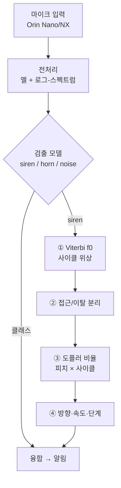
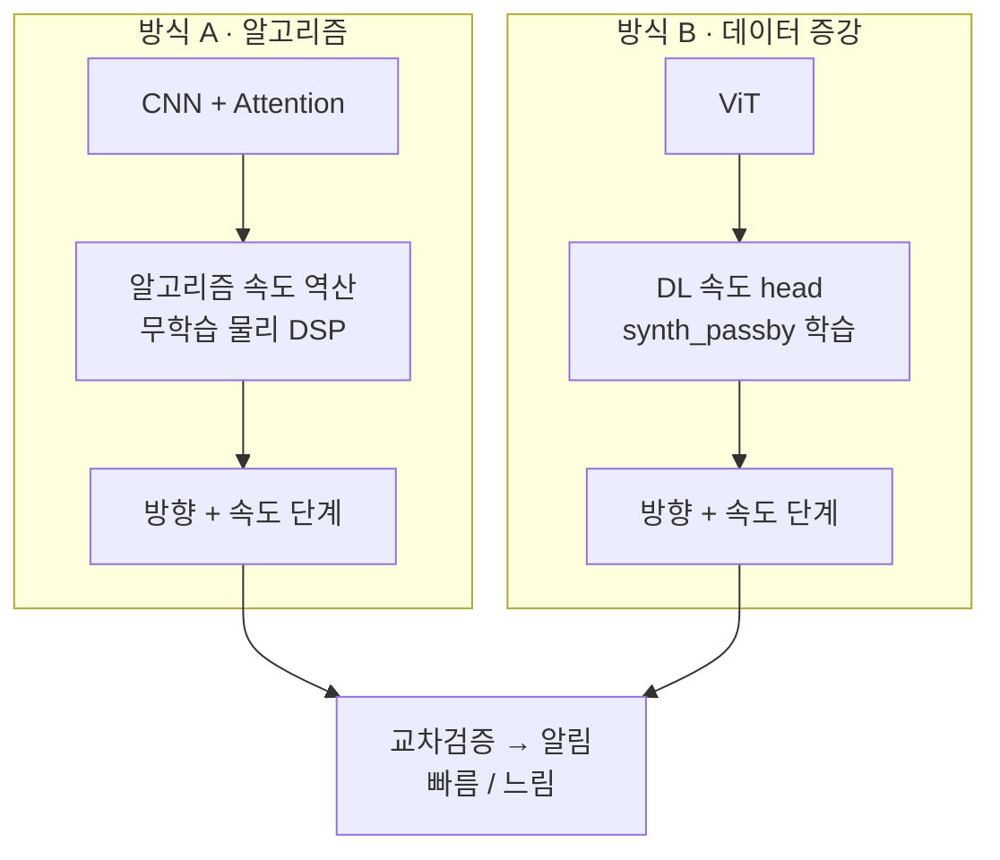

# 04 · 아키텍처 & 설계 방식 비교

## 설계 원칙: 세 축을 분리한다

초기 두 "패키지" 안은 사실 **독립적인 3개 축**을 섞고 있었다. 공정한 비교는 한 축씩 바꾸는 것.

| 축 | 선택지 | 핵심 |
|----|--------|------|
| 검출 모델 | CNN+Attention ↔ ViT | 둘 다 Orin OK. 진짜 비교 가치 |
| 증강 | 슬라이딩윈도우 ↔ 배속/통과합성 | **양자택일 아님 — 같이 씀** |
| 속도 추정 | 알고리즘 DSP ↔ 딥러닝 | 진짜 갈림길 |

## 역할 분담의 근거: 라벨이 진짜냐 합성이냐

| 출력 | 라벨 출처 | 기준선 (안전 기본값) | 검증 대상 |
|------|----------|--------------------|----------|
| siren/horn/noise **검출** | 진짜 데이터 28,643개 | — | CNN+Attn(A) vs ViT(B) |
| 접근/이탈 **방향**, **속도** | 진짜 라벨 없음 → **합성으로만 생성 가능** | **물리 DSP(A)** — 라벨 불필요, sim-to-real 갭 0 | **ViT + synth_passby 증강 학습(B)** — 합성 라벨 학습이 물리식을 재현하는가 |

데이터에 방향·속도 정답이 없으므로, 학습으로 풀려면 **합성 라벨**이 유일한 길이고 그만큼 **합성→실제 전이 리스크**를 진다. 물리 DSP는 학습이 없어 그 리스크가 없고 해석가능하다(“주파수가 960→890으로 떨어짐 → 이탈”). 그래서 **A를 안전 기본값·채점 기준으로 두고, B(증강 학습)가 그걸 재현·능가하는지를 교차검증**하는 것이 이 비교의 핵심 질문이다 — DL은 "선택 사항"이 아니라 **검증 대상 가설**이다.

## 전체 구조



## 방식 A vs 방식 B (교차검증 대상)



| 항목 | 방식 A | 방식 B |
|------|--------|--------|
| 검출 모델 | CNN + Attention | ViT |
| 증강 | 슬라이딩 + 파형 | **synth_passby (통과 합성)** |
| 속도 추정 | 알고리즘 물리 DSP (무학습) | DL head (학습) |
| 속도 라벨 | 불필요 | synth_passby가 자동 생성 |
| 장점 | 해석가능 · 즉시 동작 · sim-real 갭 0 | end-to-end · 잡음강인 기대 |
| 단점 | 배음 edge case 수동 튜닝 | 합성→실제 전이 리스크 |
| 출력 | 방향 + 속도 단계 | 방향 + 속도 단계 |

위 표는 요약이고, 아래에 축별로 풀어서 설명한다.

### 축 1 · 검출 모델: CNN+Attention vs ViT

**CNN + Temporal Attention (~0.6M params)**
- 구조: Conv2d 블록 ×3 (32→64→128, 각 MaxPool) → 주파수축 풀링 → Temporal Attention(Linear 128→64 → Tanh → Linear 64→1 → Softmax) → 가중합 context vector → 분류기.
- 강점: convolution의 귀납적 편향(국소성·이동불변성) 덕에 **소량 데이터(siren 2,239)에서 안정적**. attention 가중치를 시각화하면 "윈도우의 어느 구간을 보고 판단했는지" 보여줄 수 있어 부분적 해석가능성도 있음.
- 약점: 수용영역이 국소적이라 4.7 s 장주기 wail 같은 **전역 반복 구조**는 층을 쌓아야 간접적으로 포착.

**ViT (~0.8M params)**
- 구조: 멜 스펙트로그램 → 8×8 패치 임베딩 → CLS 토큰 + positional embedding → Pre-LN Transformer encoder 4층(4헤드) → CLS로 분류.
- 강점: self-attention이 **전역 시간 구조(사이클 반복)를 1층부터 직접** 봄 → 윈도우 전체에 걸친 소방차 wail 패턴 등에 유리할 가능성.
- 약점: 귀납적 편향이 없어 데이터 요구량이 큼. 2~3만 샘플 규모에선 SpecAugment/Mixup/CutMix가 사실상 필수.

**하드웨어 변경이 이 비교에 주는 효과**: RPi5(CPU) 시절의 "CNN 20 ms vs ViT 40 ms" 지연 명분이 Orin(GPU·TensorRT)에서 소멸 → 이 비교는 **속도가 아니라 정확도·견고성** 싸움이 됨.

**공정 비교 조건**: 동일 split · 동일 증강 · 동일 학습 스케줄에서 **모델 축만** 교체. (증강을 모델과 묶어 바꾸면 성능 차이의 원인 식별 불가)

### 축 2 · 증강: 슬라이딩+파형 vs synth_passby

**공통 증강 (검출 학습용 — 두 방식 모두 사용)**
- 슬라이딩 윈도우: 5 s 윈도우 · 1 s stride (소방 wail 1주기 ~4.7 s 포함)
- 파형 레벨: 피치시프트 ±2반음, 타임스트레치 0.85~1.15×, 게인 ±6 dB, noise 클래스와 SNR 5~20 dB 합성
- 균일 배속 0.8~1.3×: 올바른 용도는 **검출기의 도플러 불변성 학습**(접근/이탈로 피치가 떠도 siren으로 인식). 속도 *라벨*로는 부적합 ([docs/03](03-doppler-speed.md)의 라벨 모순).

**B 전용: synth_passby (통과 합성)**
- 물리 모델: source 시간 τ → 관측 시간 `t = τ + r(τ)/c` 워핑, `r(τ) = √(d_min² + v²(τ−t₀)²)`, `1/r` 진폭 감쇠. 등속 직선 통과의 정확한 지연시간(retarded-time) 모델.
- **라벨 자동 생성**: 합성 파라미터 (v, d_min, SNR, t₀)를 우리가 정하므로 (스펙트로그램 → 연속 속도 v · 방향 · 통과시각) 학습쌍이 무한 생성됨.
- 랜덤화 권장 범위: v ~ U(0, 80 km/h) **연속 샘플링** (v=0 포함 — "정지"), d_min 5~30 m, SNR 5~20 dB, 시작 위상 랜덤.
- 본질: A/B의 차이는 "증강 종류"가 아니라 **속도 라벨을 만들어 학습하느냐**다.

### 축 3 · 속도 추정: 물리 DSP vs DL head

**A: 무학습 물리 DSP (구현 완료 · 검증됨)**
1. **Viterbi f0 추적** — 하모닉 salience + 시간연속성 DP. 프레임 독립 추적의 배음 널뛰기 19.2% → 3.6%.
2. **접근/이탈 분리** — 글라이드(최대 하강) 검출로 pass-by 시각 추정.
3. **도플러 비율** — 접근·이탈 구간 평균 스펙트럼의 로그-주파수 상호상관 (전 배음이 함께 기여 → 잡음·널뛰기 강건). 물리 상한 캡 ratio < 1.2 (≈100 km/h) + prominence 게이트로 배음 오정합 차단. 진폭 envelope 사이클 비율로 교차확인.
4. **v = c(r−1)/(r+1)** → tier 비닝 → 슬라이딩 윈도우 시간축 중앙값.
- 실측: 합성 pass-by에서 **중앙값 오차 7–9 km/h, 10 dB 잡음까지 유지**. 평균 오차 ~24 km/h는 소방차 극단 사이클 outlier 때문이며 중앙값 필터가 흡수.
- 연산 비용: FFT 수 회 + DP — Orin에서 ms 단위, GPU 불필요.

**B: DL 속도 head (구축 예정)**
- 입력: 검출 backbone의 feature 공유(추가 비용 ~0) 또는 별도 멜. 출력: **연속 속도 회귀 v̂**(km/h) + 접근/이탈 방향 logit (멀티태스크: Huber + BCE). 도플러 변화량이 `Δf/f ≈ v/c`로 **연속·준선형**이라 라벨도 연속 샘플링이 자연스럽고, 이산 tier 분류보다 보간 일반화에 유리 — tier는 v̂의 비닝으로 파생 ([docs/06](06-model-design-and-training.md) §3.1).
- 기대 이점: ① 학습된 잡음 강인성 — DSP가 게이트로 기권하는 저SNR에서도 출력 가능 ② 추론이 forward 1패스 — DSP의 가변 latency 없음 ③ backbone 공유 시 사실상 공짜.
- **핵심 리스크 — sim-to-real**: 합성이 못 담는 것들 = 잔향/다중경로(터널·빌딩 협곡), 자차 이동(상대속도 합성), 마이크·차체 음향 특성, 비표준/신형 사이렌. **합성셋 정확도가 실도로 정확도를 보장하지 않음.**
- 완화책: ① A와 상시 교차검증 ② 합성 다양화(잔향 IR, 자차속도 항 추가) ③ 신뢰도 보정(temperature scaling).

### 실패 모드 비교

| 상황 | 방식 A (DSP) | 방식 B (DL) |
|------|-------------|-------------|
| 소방차 빠른 yelp (0.17 s) | 배음 콤 오정합 → 캡/게이트로 기권 | 학습 분포에 포함 가능 → 우위 기대 |
| 소방차 느린 wail (4.7 s) | 윈도우 < 1주기면 비율 불안정 | 동일 한계 (정보 자체가 부족) |
| 저SNR (< 5 dB) | 게이트 기권 (무출력) | 출력은 내지만 신뢰도 불명 → 보정 필요 |
| 잔향·다중경로 | 비율 왜곡 가능 | 학습 안 했으면 예측 불가 |
| 다중 사이렌 동시 | 상호상관 피크 분리 가능 | 혼합 라벨 합성 추가하면 학습 가능 |
| 비표준 사이렌 (신형) | 물리식이라 그대로 적용 | 분포 밖 → 성능 저하 |

요약: **A는 "모르면 기권"(안전), B는 "항상 답하지만 보증 없음"** — 그래서 교차검증이 필요하다.

### 평가 프로토콜 (공정 비교)

1. **검증셋 고정**: 학습에 안 쓴 held-out 정지 클립에 synth_passby 적용 — 시드 고정, A·B 동일 셋.
2. **지표**: km/h MAE(A·B 모두 연속 출력), 파생 tier 정확도·혼동행렬, 방향(접근/이탈) 정확도.
3. **스트레스 sweep**: SNR {clean, 20, 10, 5 dB} × d_min {5, 15, 30 m} × 차종(경찰/구급/소방).
4. **실데이터 일치율**: 라벨 없는 자연 녹음(acqMethod=자연적)에서 A–B agreement 측정 — 합성셋에선 둘 다 좋은데 실데이터에서 불일치가 급증하면 **B의 도메인 갭 신호** (sim-to-real의 간접 지표).
5. **Orin 지연**: B는 TensorRT end-to-end, A는 FFT+DP 시간 별도 측정.

### 교차검증 · 운용 규칙

- 두 추정 **일치 → 신뢰도 상향** (알림 확신도 올림).
- **불일치 → A(물리)를 우선** — 안전 기본값. B는 보조 신호로 강등.
- A가 게이트로 **기권한 구간 → B 단독** 사용 + 신뢰도 하향 표기.
- **A가 B의 채점관**: 합성 검증셋에서 A가 정답에 근접(7–9 km/h)함이 확인됐으므로, 라벨 없는 실데이터에서 B의 품질을 "A와의 일치도"로 근사 평가할 수 있다.

## 속도 단계 (tier)

**알림 출력**은 절대 km/h 대신 단계로 단순화 (경계는 나중 캘리브레이션):

```
정지/배경  →  접근(느림)  →  접근(빠름)        + 방향(접근/이탈)
   v≈0         ~0–40km/h       40km/h+
```

tier는 **알림 출력 단계**다 — 내부 추정은 A(물리식)·B(회귀) 모두 **연속 km/h**로 하고 마지막에 비닝한다. 절대정밀도 부담은 출력 단계에서 사라지고, 연속 추정을 유지하므로 비닝 경계는 캘리브레이션에서 자유롭게 조정한다.

## 하드웨어 메모 (RPi5 → Jetson Orin)

핸드오프 초기안은 Raspberry Pi 5(CPU)였으나 **Jetson Orin Nano/NX**로 변경됨:
- GPU + TensorRT → **ViT 지연 문제 소멸** (CNN을 "속도 때문에" 골라야 할 근거 약화)
- 추론: ONNX → TensorRT EP 권장 (CPUExecutionProvider 아님)
- 검출 모델 선택이 자유로워져, ViT 단독 검출도 충분히 실용적

## 탈락 모델

| 모델 | 이유 |
|------|------|
| CRNN(LSTM) | 순차 처리 느림, ONNX 변환 까다로움 |
| CapsNet | 라우팅 연산 느림, ONNX 지원 미흡 |
| 순수 RNN | 2D 스펙트로그램 구조 미활용 |
